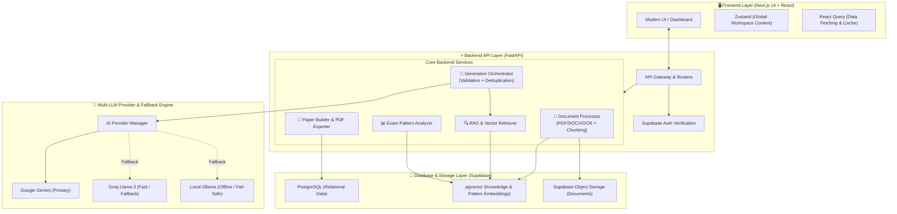

# Learnova - Project Overview & System Architecture

## 1. High-Level Summary (The 1-Minute Pitch)

**Learnova** is an **AI-driven Question Paper & Assessment Generation Platform** tailored for educators and institutions. It uses **Retrieval-Augmented Generation (RAG)** to transform raw teaching materials (PDFs, Notes, Past Exam Papers) into curated, syllabus-aligned, and verified question banks with automated paper assembly.

---

## 2. High-Level System Architecture

---

## 3. Layer-by-Layer Breakdown

### 1. Frontend Layer (`/frontend`)
* **Technology**: Next.js 14 (App Router), TypeScript, Tailwind CSS, Radix/Base UI components, Zustand, TanStack React Query.
* **Role**:
  * **Global Workspace Context**: Allows switching between different Exams (e.g., KCET, NEET) and Subjects smoothly using Zustand stores.
  * **Modules**:
    * **Knowledge Base**: Upload course files, textbooks, and past papers.
    * **Pattern Analyzer**: Visualizes question distribution, question formats, and syllabus weightage.
    * **AI Generator**: Configure question type (MCQ, SAQ, LAQ), difficulty, and target topics.
    * **Question Bank & Review**: Review, edit, approve, or discard generated questions.
    * **Paper Builder**: Blueprint builder with sections, marks configuration, and printable export.

---

### 2. Backend API Layer (`/backend`)
* **Technology**: FastAPI (Python 3.10+), SQLAlchemy (Async ORM), Pydantic, Alembic.
* **Role**: High-performance asynchronous REST API handling business logic and orchestration.
* **Key Components**:
  * **Document Processor (`app/services/document_processor/`)**: Handles file uploading, PDF/DOCX parsing, OCR for scanned notes, text cleaning, and semantic chunking.
  * **RAG Engine (`app/services/rag/`)**: Performs cosine similarity search on vector embeddings to extract relevant context snippets before passing them to the AI.
  * **Generation Orchestrator (`app/services/generation/`)**:
    * Crafts prompts with retrieved context.
    * **JSON Schema Validator**: Guarantees questions strictly adhere to expected format.
    * **Deduplicator**: Compares new questions with existing question banks using embeddings to prevent repeat questions.
  * **Paper Service (`app/services/paper/`)**: Compiles blueprints into complete question papers and exports to structured PDF/DOCX.

---

### 3. AI & LLM Fallback Engine (`app/services/ai/`)
* **Dynamic Multi-Provider Setup**:
  * **Primary**: Google Gemini API (High quality reasoning).
  * **Secondary / Fast**: Groq API (High speed inference).
  * **Fail-Safe / Offline**: Local Ollama (e.g., Llama 3 running locally).
* **Automated Fallback Chain**: If the primary AI hits a rate-limit (HTTP 429) or times out, the system automatically falls over to the next provider without failing the user's request.

---

### 4. Database & Storage Layer
* **Technology**: Hosted Supabase (PostgreSQL with `pgvector`).
* **Role**:
  * **Relational Tables**: Users, Exams, Subjects, Questions, Blueprints, Papers, Permissions/Shares.
  * **Vector Embeddings (`pgvector`)**: Stores document chunk embeddings and question embeddings for instant semantic search and deduplication.
  * **Storage Bucket**: Stores source PDF/DOCX files securely.

---

## 4. Core Workflows (How It Works in Practice)

### Workflow 1: Knowledge Ingestion & Indexing
1. Teacher uploads a chapter PDF or syllabus document.
2. The backend extracts text (with OCR if scanned), cleans formatting, and splits into semantic chunks.
3. Chunks are converted into vector embeddings and saved into `pgvector`.

### Workflow 2: AI Question Generation with Anti-Duplication
1. Teacher specifies: *"Generate 5 Hard MCQs on Thermodynamics"*.
2. The RAG engine searches `pgvector` for the most relevant textbook chunks.
3. The prompt is sent to the LLM (Gemini / Groq / Ollama).
4. The generated questions are validated for schema and mathematically/logically checked.
5. Embeddings of new questions are checked against existing questions in the database to discard duplicates.
6. Approved questions are added to the institution's **Question Bank**.

### Workflow 3: Question Paper Assembly
1. Teacher creates a Blueprint (e.g., *Section A: 10 MCQs (1 mark each), Section B: 5 SAQs (2 marks each)*).
2. The builder selects questions from the bank or triggers auto-fill.
3. The final paper is rendered into an exam-ready format and exported to printable PDF.

---

## 5. Key Highlights / Advantages

| Feature | How Learnova Solves It |
| :--- | :--- |
| **No AI Hallucinations** | Strict RAG pipeline grounds questions only in the teacher's uploaded context. |
| **High Availability** | Multi-LLM fallback chain (Gemini $\rightarrow$ Groq $\rightarrow$ Ollama) prevents downtime. |
| **No Duplicate Questions** | Vector similarity deduplication ensures diverse questions over multiple tests. |
| **Institutional Ready** | Multi-tenant structure with Exam $\rightarrow$ Subject hierarchy and role-based sharing. |
